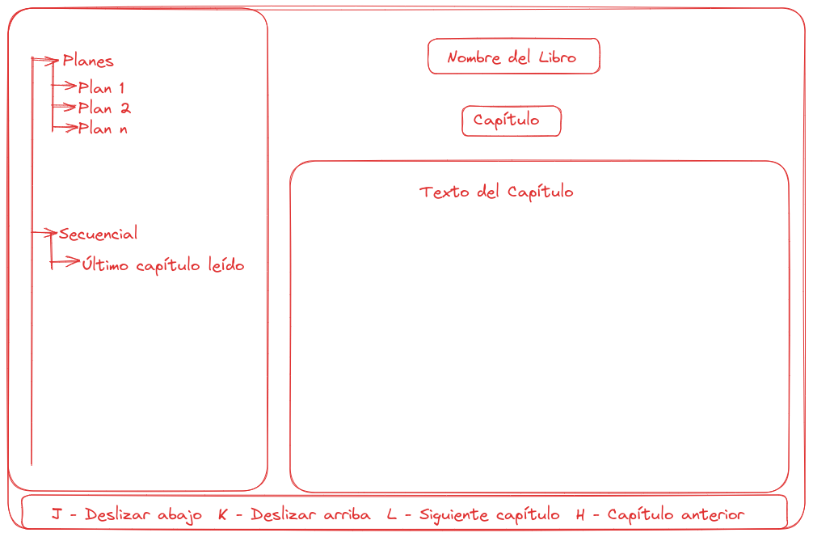

# cli-bible

Leer la Biblia desde la línea de comandos.

Biblias tomadas de [ebible.org](https://ebible.org/find/)

## ToDo

- DONE: Manejar archivos de configuración
- DONE: Maquetar la app
- TODO: Organizar el texto por libros (directorio) y capítulos (1 archivo por
  cada capítulo)
- TODO: Organizar planes
- TODO: Descargar la biblia, para no incluirlo en el paquete.
